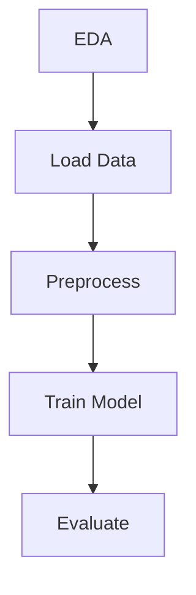

## Задача и пайплайн

**Задача машинного обучения:**  
Классификация образцов опухолей молочной железы на доброкачественные и злокачественные (binary classification) с помощью логистической регрессии.

**Структура пайплайна:**  
1. **EDA** (`00_eda.py`) — анализ распределений признаков, выявление пропусков и выбросов, сохранение результатов (`results/eda.txt`). 
2. **Загрузка данных** (`01_load_data.py`) — чтение `breast_cancer_raw.csv`, первичная валидация и сохранение очищенного датасета.  
3. **Предобработка** (`02_preprocess.py`) — нормализация признаков (`StandardScaler`), переименование колонок, сохранение преобразованных данных.  
4. **Обучение модели** (`03_train.py`) — обучение `LogisticRegression`, кросс-валидация, сохранение модели (`results/logreg.pkl`).  
5. **Оценка метрик** (`04_evaluate.py`) — расчёт `accuracy`, `precision`, `recall`, `F1`; сохранение результатов в `results/metrics.json`.  

**Схема пайплайна:**  


## Структура репозитория

```bash
ml-pipeline-project/
├── data/
│ └── breast_cancer_raw.csv # исходный CSV с сырыми данными
├── etl/
│ ├── 00_eda.py 
│ ├── 01_load_data.py 
│ ├── 02_preprocess.py 
│ ├── 03_train.py 
│ └── 04_evaluate.py 
├── results/
│ ├── eda.txt # результаты EDA (описание)
│ ├── logreg.pkl # сериализованная модель LogisticRegression
│ └── metrics.json # метрики (accuracy, precision, recall, F1)
├── config.yaml # параметры пайплайна (пути, гиперпараметры)
├── requirements.txt # зависимости проекта
└── README.md # документация проекта
```

**Оркестрация пайплайна не была реализована. Причины:**
- Проблемы с развёртыванием Apache Airflow на Windows (ошибки с путями в SQLite, отсутствующие модули `daemon`, `pwd`, `resource`).
- Жёсткие сроки — не успели устранить все несовместимости.

**Текущее решение:**
- Все скрипты выполняются последовательно вручную (или через простой PowerShell-скрипт).
- Все промежуточные и итоговые файлы сохраняются на локальном диске (оба артефакта (`logreg.pkl`, `metrics.json`) собираются и сохраняются в `results/`)
